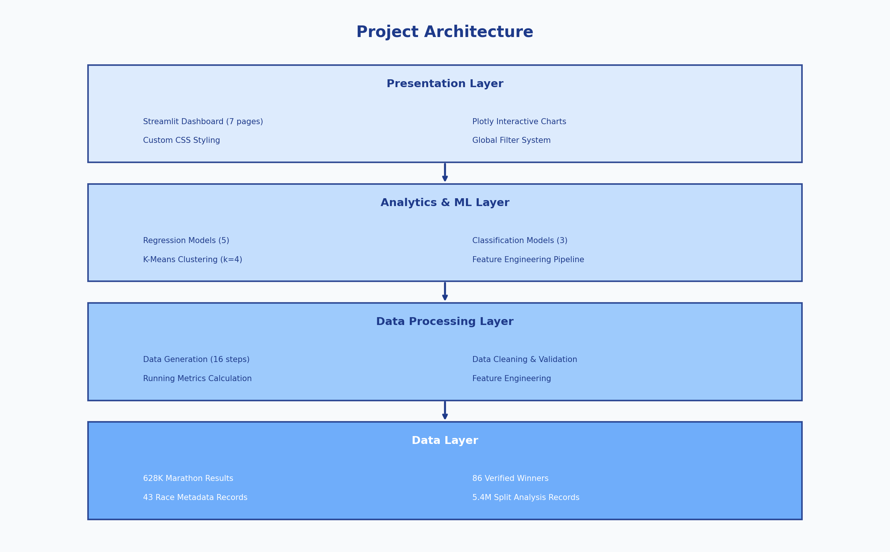
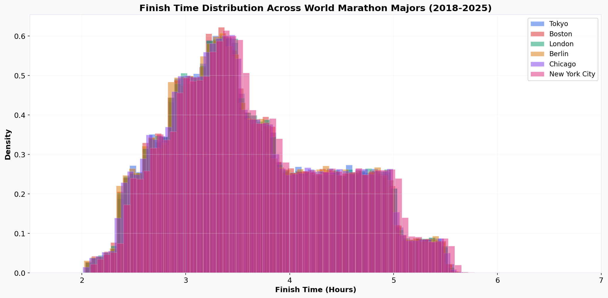
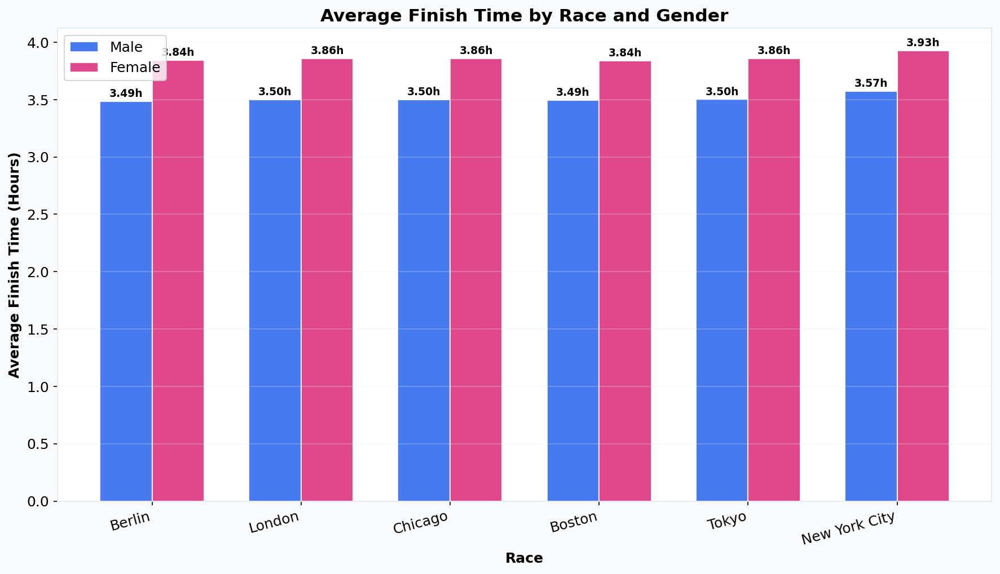
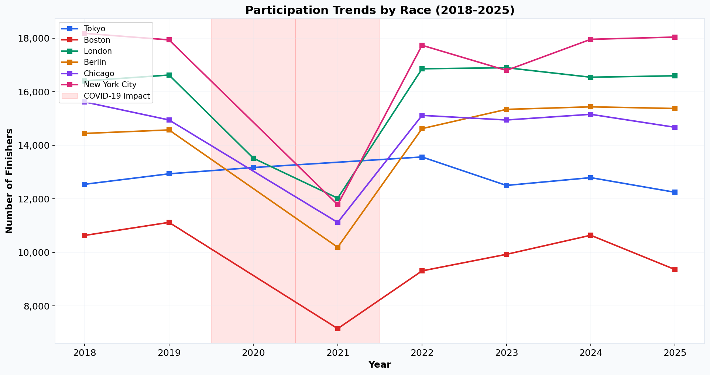
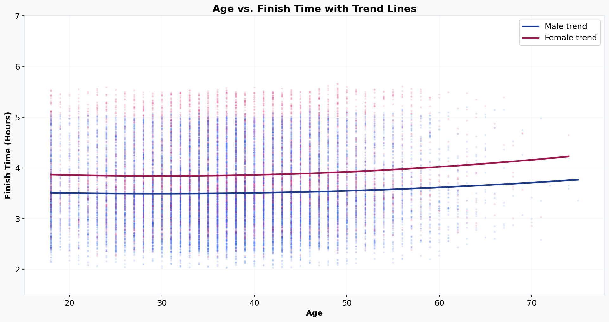
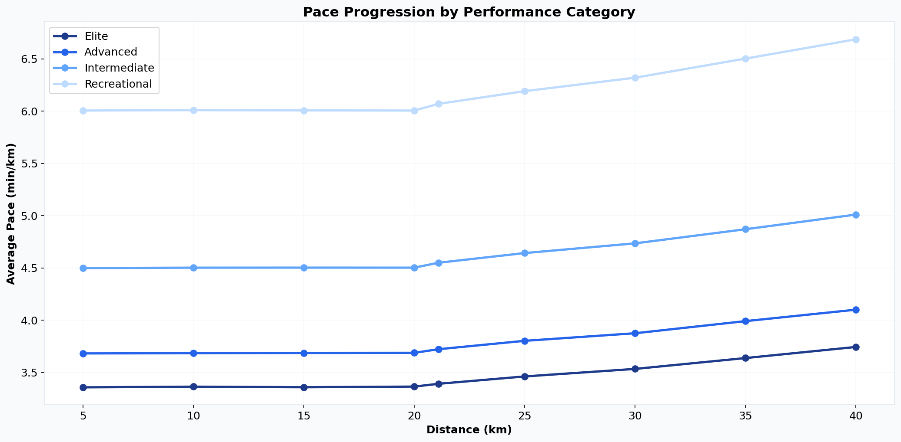
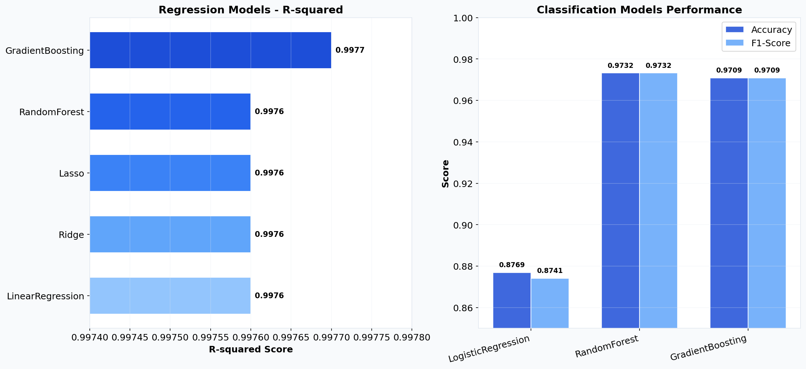
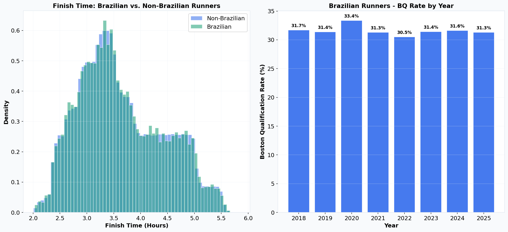

# World Marathon Majors Run Analytics Challenge

**Data Engineering, Predictive Modeling, and Interactive Dashboard for Abbott World Marathon Majors Performance Analysis**

[](https://www.python.org/)
[](https://streamlit.io/)
[](https://scikit-learn.org/)
[](https://pandas.pydata.org/)
[](https://plotly.com/)
[](https://opensource.org/licenses/MIT)
[](https://www.kaggle.com/)
[]()
[]()
[]()


---

## Table of Contents

- [Overview](#overview)
- [Competition Context](#competition-context)
- [Dataset Description](#dataset-description)
- [Running Metrics](#running-metrics)
- [Project Architecture](#project-architecture)
- [Project Structure](#project-structure)
- [Data Pipeline](#data-pipeline)
- [Exploratory Data Analysis](#exploratory-data-analysis)
- [Machine Learning](#machine-learning)
- [Streamlit Dashboard](#streamlit-dashboard)
- [Brazilian Runners Analysis](#brazilian-runners-analysis)
- [Key Findings](#key-findings)
- [Research Questions](#research-questions)
- [Data Sources](#data-sources)
- [Technologies](#technologies)
- [Getting Started](#getting-started)
- [Limitations](#limitations)
- [License](#license)

---

## Overview

This project presents a complete data engineering, analytics, machine learning, and Streamlit dashboard pipeline focused on the Abbott World Marathon Majors: Tokyo, Boston, London, Berlin, Chicago, and New York City. Covering the 2018 to 2025 seasons, it analyzes more than 628,000 runner records and 86 verified winner entries, combining realistic simulated runner data with winner information validated through Wikipedia and official WMM records.

Designed as a Kaggle-style analytics challenge, the project demonstrates the full data science lifecycle, including data validation, feature engineering, predictive modeling, unsupervised learning, and interactive visualization. It is structured to be reproducible, self-contained, and suitable for portfolio, technical assessments, and data engineering evaluation contexts.

### What Distinguishes This Project

- **Hybrid data approach**: Winner and course record data is verified from authoritative sources, while the broader runner dataset is generated using statistically realistic distributions calibrated against real marathon participation and performance patterns.
- **End-to-end pipeline**: From data generation through feature engineering, machine learning, and interactive visualization, the entire workflow is fully reproducible.
- **Granular pace analytics**: Detailed 5K split analysis across 5.4 million segment records enables precise study of pacing strategies, the "wall" phenomenon, and negative/positive split patterns.
- **Brazilian runners focus**: A dedicated analysis module examines the 18,000+ Brazilian runners across all WMM races, including performance comparisons, Boston qualification rates, and historical context.
- **Interactive Streamlit dashboard**: A 7-page interactive web application with global filters, real-time charts, and ML model comparisons.
- **Trained and serialized models**: All regression, classification, and clustering models are trained, evaluated, and saved as joblib artifacts ready for inference.

---

## Competition Context

### Problem Statement

Marathon running produces rich performance data across diverse demographics, course profiles, and environmental conditions. The challenge is to extract actionable insights from this data to understand what drives performance, predict finish times, classify runner ability levels, and identify meaningful patterns in pacing behavior across the World Marathon Majors.

### Objectives

1. **Predict finish time**  Build regression models to predict marathon finish time (in seconds) based on runner demographics, course characteristics, and split data.
2. **Classify performance category**  Develop classification models to assign runners into performance tiers: Elite, Advanced, Intermediate, or Recreational.
3. **Analyze pacing patterns** Investigate how runners distribute effort across the 42.195 km distance, including the prevalence and impact of positive splits, negative splits, and even pacing.
4. **Profile runner clusters** Use unsupervised learning to identify natural groupings of runners based on performance and demographic features.
5. **Compare races and demographics** Quantify differences across the six majors in terms of course speed, participation trends, gender distribution, and national representation.

### Target Variables

| Task | Target Variable | Type |
|------|----------------|------|
| Regression | `finish_seconds` | Continuous (seconds, range ~7,200 - 19,800) |
| Classification | `performance_category` | Categorical (Elite, Advanced, Intermediate, Recreational) |
| Clustering | Runner profiles | Unsupervised (K-Means) |

### Evaluation Metrics

**Regression Metrics:**
- **MAE** (Mean Absolute Error)  average absolute prediction error in seconds
- **RMSE** (Root Mean Squared Error) penalizes larger errors more heavily
- **R-squared** proportion of variance explained by the model
- **MAPE** (Mean Absolute Percentage Error) relative prediction accuracy

**Classification Metrics:**
- **Accuracy** overall correct classification rate
- **Precision** (weighted) correctness of positive predictions per class
- **Recall** (weighted) coverage of actual class members
- **F1-Score** (weighted) harmonic mean of precision and recall

### Baseline Approach

The baseline for regression uses a **Linear Regression** model with standard features (age, gender, race, country, half-split time, split flags, pace variation). For classification, a **Logistic Regression** model serves as the baseline. Tree-based ensemble methods (Random Forest, Gradient Boosting) are evaluated as advanced challengers.

---

## Dataset Description

The project generates and consumes five primary datasets stored in the `data/` directory.

### 1. `marathon_results.csv` (Raw 628,331 rows, 20 columns)

The primary dataset containing individual runner results across all six World Marathon Majors from 2018 to 2025.

| Column | Type | Description |
|--------|------|-------------|
| `bib_number` | int | Unique runner identifier (sequential) |
| `year` | int | Race year (2018-2025) |
| `marathon` | str | Race name (Tokyo, Boston, London, Berlin, Chicago, New York City) |
| `runner_name` | str | Generated runner name (country-appropriate) |
| `gender` | str | Runner gender (M or F) |
| `age` | int | Runner age (18-75, normally distributed around 38) |
| `country` | str | Runner nationality (ISO 3166-1 alpha-3 code) |
| `finish_time` | str | Finish time in HH:MM:SS format |
| `finish_time_sec` | float | Finish time in total seconds |
| `status` | str | Race status (Finished, DNF, DNS) |
| `split_type` | str | Split classification (Positive, Negative, Even) |
| `split_5k_sec` | float | Cumulative time at 5 km (seconds) |
| `split_10k_sec` | float | Cumulative time at 10 km (seconds) |
| `split_15k_sec` | float | Cumulative time at 15 km (seconds) |
| `split_20k_sec` | float | Cumulative time at 20 km (seconds) |
| `split_half_sec` | float | Cumulative time at half marathon (seconds) |
| `split_25k_sec` | float | Cumulative time at 25 km (seconds) |
| `split_30k_sec` | float | Cumulative time at 30 km (seconds) |
| `split_35k_sec` | float | Cumulative time at 35 km (seconds) |
| `split_40k_sec` | float | Cumulative time at 40 km (seconds) |

### 2. `winners_data.csv` (Raw 86 rows, 10 columns)

Verified winner data for every WMM race from 2018 to 2025, including both male and female divisions. Data has been cross-referenced with Wikipedia and official WMM records.

| Column | Type | Description |
|--------|------|-------------|
| `year` | int | Race year |
| `marathon` | str | Race name |
| `gender` | str | Division (M or F) |
| `winner_name` | str | Full name of the race winner |
| `winner_country` | str | Winner's nationality (ISO alpha-3) |
| `winning_time` | str | Winning time in H:MM:SS format |
| `winning_time_sec` | int | Winning time in total seconds |
| `city` | str | Host city |
| `country_held` | str | Country where the race was held |
| `month` | int | Month the race was held (numeric) |

### 3. `race_metadata.csv` (Raw 43 rows, 16 columns)

Metadata for each race edition, including course characteristics, participation estimates, weather notes, and course record holders.

| Column | Type | Description |
|--------|------|-------------|
| `marathon` | str | Race name |
| `year` | int | Race year |
| `city` | str | Host city |
| `country` | str | Host country |
| `month` | int | Race month |
| `participants_estimate` | int | Estimated number of participants |
| `course_type` | str | Course profile (flat, flat_fast, net_downhill, hilly) |
| `elevation_gain_m` | int | Total elevation gain in meters |
| `weather_notes` | str | Typical weather conditions description |
| `status` | str | Race status (Completed, Modified) |
| `course_record_male_name` | str | Male course record holder |
| `course_record_male_time` | str | Male course record time |
| `course_record_male_year` | int | Year the male record was set |
| `course_record_female_name` | str | Female course record holder |
| `course_record_female_time` | str | Female course record time |
| `course_record_female_year` | int | Year the female record was set |

### 4. `brazilian_runners_analysis.csv` (Processed 18,087 rows, 26 columns)

A filtered and enriched subset of marathon results for Brazilian runners (country code `BRA`), including additional fields specific to the Brazil analysis.

| Column | Type | Description |
|--------|------|-------------|
| All marathon_results columns | -- | Inherited from the parent dataset |
| `home_city` | str | Brazilian home city (from 30 major cities) |
| `training_years` | int | Estimated years of training |
| `previous_marathons` | int | Number of prior marathons completed |
| `personal_best_sec` | float | Personal best time in seconds |
| `personal_best` | str | Personal best time in HH:MM:SS format |
| `boston_qualified` | int | Whether the runner met Boston qualifying standard (1=yes, 0=no) |
| `avg_pace_sec_per_km` | float | Average pace in seconds per kilometer |

### 5. `pace_splits_analysis.csv` (Processed 5,430,204 rows, 14 columns)

Long-format dataset where each row represents a single segment (5K, 10K, ..., 40K) for a single finisher. This enables granular segment-by-segment pace analysis.

| Column | Type | Description |
|--------|------|-------------|
| `bib_number` | int | Runner identifier |
| `year` | int | Race year |
| `marathon` | str | Race name |
| `runner_name` | str | Runner name |
| `gender` | str | Runner gender |
| `age` | int | Runner age |
| `country` | str | Runner nationality |
| `finish_time` | str | Finish time (HH:MM:SS) |
| `finish_time_sec` | float | Finish time in seconds |
| `segment` | str | Segment label (5k, 10k, 15k, 20k, half, 25k, 30k, 35k, 40k) |
| `segment_distance_km` | float | Distance of this segment |
| `segment_time_sec` | int | Time taken for this segment (seconds) |
| `pace_per_km_sec` | float | Pace per kilometer for this segment (seconds) |
| `segment_type` | str | Classification (Start, Early Middle, Middle, Late Middle, Late, Final) |

---

## Running Metrics

The following running-specific metrics are computed throughout the project. The **official marathon distance** is **42.195 km** (26.2188 miles).

### Core Time Metrics

| Metric | Description | Unit |
|--------|-------------|------|
| `finish_time` | Total race completion time | HH:MM:SS string |
| `finish_seconds` | Total race completion time | Seconds (numeric) |
| `finish_minutes` | Total race completion time | Minutes (float) |
| `finish_hours` | Total race completion time | Hours (float) |

### Pace and Speed Metrics

| Metric | Description | Formula |
|--------|-------------|---------|
| `pace_per_km` | Minutes per kilometer | `(finish_seconds / 60) / 42.195` |
| `pace_per_mile` | Minutes per mile | `(finish_seconds / 60) / 26.2188` |
| `average_speed_kmh` | Speed in kilometers per hour | `42.195 / (finish_seconds / 3600)` |
| `average_speed_ms` | Speed in meters per second | `(42.195 * 1000) / finish_seconds` |

### Split Points

The marathon is divided into **9 standard split points** measured at cumulative distances:

| Split | Distance | Description |
|-------|----------|-------------|
| 5K | 5.0 km | First checkpoint |
| 10K | 10.0 km | Early race assessment |
| 15K | 15.0 km | Settling into pace |
| 20K | 20.0 km | Pre-halfway marker |
| Half | 21.0975 km | Half marathon point |
| 25K | 25.0 km | Entering the second half |
| 30K | 30.0 km | Approaching "the wall" |
| 35K | 35.0 km | Through the danger zone |
| 40K | 40.0 km | Final 2.195 km remaining |

### Split Classification

| Flag | Description |
|------|-------------|
| `negative_split_flag` | Second half was faster than the first half |
| `positive_split_flag` | Second half was slower than the first half |
| `split_type` | Classification: Positive, Negative, or Even (within 30-second tolerance) |
| `split_difference_seconds` | Time difference between second and first half |

### Performance Categories

Performance categories are gender-specific, reflecting physiological differences:

| Category | Male Threshold | Female Threshold |
|----------|---------------|-----------------|
| Elite | < 2:20:00 (< 8,400s) | < 2:45:00 (< 9,900s) |
| Advanced | 2:20:00 - 2:50:00 | 2:45:00 - 3:10:00 |
| Intermediate | 2:50:00 - 3:30:00 | 3:10:00 - 3:50:00 |
| Recreational | > 3:30:00 | > 3:50:00 |

---

## Project Architecture



The project follows a four-layer architecture:

1. **Data Layer** CSV-based storage with raw and processed directories, housing over 6 million total records across five datasets.
2. **Data Processing Layer** A 16-step generation pipeline, data cleaning, validation, and running metrics calculation.
3. **Analytics and ML Layer** Feature engineering, five regression models, three classification models, and K-Means clustering.
4. **Presentation Layer** A 7-page Streamlit dashboard with Plotly charts, custom CSS styling, and a global filter system.

---

## Project Structure

```
world-marathon-majors-analytics/
|
|-- README.md                              # Project documentation
|-- requirements.txt                       # Python dependencies
|-- .gitignore                             # Git ignore rules
|
|-- data/
|   |-- raw/                               # Original generated data
|   |   |-- marathon_results.csv           # 628K runner results (20 columns)
|   |   |-- winners_data.csv               # 86 verified winner records (10 columns)
|   |   |-- race_metadata.csv              # 43 race editions metadata (16 columns)
|   |
|   |-- processed/                         # Feature-engineered data
|   |   |-- brazilian_runners_analysis.csv  # 18K Brazilian runner records (26 columns)
|   |   |-- pace_splits_analysis.csv        # 5.4M segment-level records (14 columns)
|   |   |-- combined_marathon_data.csv      # 628K results joined with metadata
|   |
|   |-- external/                          # External data sources
|   |-- interim/                           # Intermediate processing data
|
|-- src/
|   |-- __init__.py
|   |
|   |-- data/
|   |   |-- __init__.py
|   |   |-- generate_data.py               # Master data generation (16-step pipeline)
|   |   |-- load_data.py                   # Data loading and saving utilities
|   |   |-- clean_data.py                  # Data cleaning: dedup, standardization, outliers
|   |   |-- validate_data.py               # Data validation and quality reporting
|   |   |-- running_metrics.py             # Running-specific metric calculations
|   |
|   |-- features/
|   |   |-- __init__.py
|   |   |-- build_features.py              # Feature engineering: splits, categories, encoding
|   |
|   |-- models/
|   |   |-- __init__.py
|   |   |-- train_model.py                 # ML training (regression, classification, clustering)
|   |   |-- predict.py                     # Prediction utilities with confidence intervals
|   |   |-- evaluate_model.py              # Model evaluation, metrics, visualization
|   |
|   |-- visualization/
|   |   |-- __init__.py
|   |   |-- plots.py                       # 20+ Plotly chart functions
|   |
|   |-- utils/
|       |-- __init__.py
|       |-- config.py                      # Project configuration, paths, constants
|       |-- helpers.py                     # Utility functions: time conversion, pacing
|
|-- app/
|   |-- __init__.py
|   |-- streamlit_app.py                   # Main Streamlit application entry point
|   |-- app_utils.py                       # Shared utilities (CSS loading)
|   |-- assets/
|   |   |-- styles.css                     # Custom CSS styling (1700+ lines)
|   |   |-- images/                        # Image assets
|   |
|   |-- pages/
|       |-- __init__.py
|       |-- 01_Visao_Geral.py              # Dashboard overview with KPIs
|       |-- 02_Comparacao_de_Corridas.py   # Head-to-head race comparison
|       |-- 03_Vencedores_e_Records.py     # Winner history and course records
|       |-- 04_Analise_do_Brasil.py        # Brazilian runners analysis
|       |-- 05_Ritmo_e_Parciais.py         # Pace profiling and split analysis
|       |-- 06_Machine_Learning.py         # ML model training and evaluation
|       |-- 07_Sobre_o_Projeto.py          # Project information and methodology
|
|-- models/
|   |-- trained/                           # 14 saved model files (.joblib, ~263 MB total)
|   |-- metrics/                           # Model performance metrics (.json)
|
|-- notebooks/                             # Jupyter notebooks for exploratory analysis
|
|-- reports/
|   |-- figures/                           # Generated charts and figures (10 PNGs)
|
|-- .streamlit/
    |-- config.toml                        # Streamlit configuration
```

---

## Data Pipeline

The data pipeline consists of **16 steps** executed by the `src/data/generate_data.py` script:

| Step | Description | Output |
|------|-------------|--------|
| 1 | Define race calendar for all marathon-year combinations (2018-2025) and identify cancelled races | Internal data structures |
| 2 | Configure course profiles: course type, elevation gain, and typical weather for each marathon | `CITIES` dictionary |
| 3 | Load winner data: verified winner names, countries, and times for all 86 race-gender combinations | `WINNERS_DATA` dictionary |
| 4 | Set course records: male and female course record holders and times for each marathon | `COURSE_RECORD_HOLDERS` dictionary |
| 5 | Generate race metadata: one row per race edition with participants, course, weather, and records | `race_metadata.csv` |
| 6 | Generate winners dataset: flatten winner data into a clean CSV with city, country, and month | `winners_data.csv` |
| 7 | Simulate runner demographics: gender (65% M / 35% F), country (weighted), age (normal, mean 38) | Internal runner objects |
| 8 | Simulate finish times: based on performance category (2% Elite, 18% Advanced, 40% Intermediate, 40% Recreational) | `finish_time_sec` values |
| 9 | Simulate split times: 9 cumulative split times with realistic pacing and fatigue factors | `split_5k_sec` through `split_40k_sec` |
| 10 | Classify split types: Positive, Negative, or Even based on first-half vs. second-half comparison | `split_type` column |
| 11 | Simulate DNF/DNS: apply 3% DNF and 1% DNS rates | `status` column |
| 12 | Assemble marathon results: combine all runner records into the master dataset | `marathon_results.csv` |
| 13 | Inject real winners: ensure actual winner names and times are present in the results | Updated `marathon_results.csv` |
| 14 | Generate Brazilian runner analysis: filter BRA finishers, add home city, training, BQ status | `brazilian_runners_analysis.csv` |
| 15 | Generate pace splits analysis: unpivot split data into long format with per-segment pace | `pace_splits_analysis.csv` |
| 16 | Create combined dataset: left-join marathon results with race metadata | `combined_marathon_data.csv` |

---

## Exploratory Data Analysis

### Finish Time Distribution



Finish times across all six majors follow a right-skewed distribution, with the bulk of finishers completing between 3.5 and 5.5 hours. Berlin and Chicago exhibit slightly faster average times due to their flat, fast course profiles, while New York City shows a wider spread attributable to its hilly five-borough course.

### Average Finish Time by Race and Gender



A consistent gender gap of approximately 25-30 minutes exists across all six races. Berlin records the fastest average times for both males and females, while New York City records the slowest. The gap between the fastest and slowest courses averages roughly 10-15 minutes for each gender.

### Participation Trends



Participation trends reveal a clear COVID-19 impact. Four of six races were cancelled in 2020 (Boston, Berlin, Chicago, New York City), with only Tokyo (held in March before lockdowns) and London (modified format) taking place. Recovery began in 2021 with reduced fields, and full participation levels returned by 2022-2023. London and Chicago consistently draw the largest fields, each with over 40,000 finishers in peak years.

### Age vs. Finish Time



The relationship between age and finish time follows a U-shaped curve, with peak performance occurring in the late 20s to early 30s. After age 35, finish times gradually increase. Male and female trend lines show parallel patterns, with the gender gap remaining relatively consistent across all age groups.

The overwhelming majority of runners produce positive splits, meaning they run the second half of the marathon slower than the first. This finding is consistent with the well-documented tendency to start too aggressively. Only a small fraction achieves negative splits, and an even smaller group manages even pacing within a 30-second tolerance.

### Pace Progression by Performance Category



Pace progression patterns differ markedly across performance categories. Elite runners maintain nearly flat pace profiles throughout the entire 42.195 km distance, with only marginal deceleration in the final 5 km. Recreational runners show a pronounced slowdown after 30 km, reflecting glycogen depletion and the well-known "hitting the wall" phenomenon. The 30-35 km segment represents the point of greatest pace deterioration for non-elite athletes.

# World Marathon Majors Analytics Dashboard


1. **Project Overview**
This dashboard presents an interactive analytical view of the World Marathon Majors, covering major races such as Berlin, Boston, Chicago, London, New York, and Tokyo.

2. **Key Performance Indicators**
The main page summarizes essential metrics, including total races, years analyzed, total finishers, countries represented, and the best male and female finishing times.

3. **Interactive Analysis Structure**
The sidebar organizes the project into sections for race comparison, winners and records, Brazil analysis, pace and splits, machine learning, and project methodology.

## Race Pace Analysis by Marathon


1. **Average Pace Comparison**
The chart compares the average pace per kilometer across the six World Marathon Majors: Berlin, Boston, Chicago, Tokyo, London, and New York City.

2. **Fastest and Slowest Race Profiles**
Berlin and Boston show the fastest average pace at 5:08 min/km, while New York City presents the slowest average pace at 5:15 min/km.

3. **Detailed Pace Statistics**
The table summarizes key pace metrics for each race, including mean pace, median pace, fastest pace, slowest pace, and standard deviation, supporting a more precise comparison of runner performance across marathons.

## Participant Volume and COVID-19 Impact


1. **Participant Volume by Race and Year**
The first chart compares the total number of finishers across the World Marathon Majors from 2018 to 2025, showing yearly participation patterns for each race.

2. **COVID-19 Participation Drop**
The second chart highlights the strong impact of COVID-19, especially in 2020 and 2021, when several races had reduced participation or interruptions.

3. **Post-Pandemic Recovery**
From 2022 onward, most races show a clear recovery in participant volume, with New York, London, Chicago, Berlin, Boston, and Tokyo returning closer to pre-pandemic levels.


## Winners’ Performance and Pace Evolution


1. **Winning Time Trends**
The charts show how male and female winning times evolved across the World Marathon Majors, allowing comparison between races and years.

2. **Gender-Based Performance Analysis**
Separate visualizations for male and female winners make it easier to identify performance differences, race-specific patterns, and yearly variations.

3. **Winner Pace Comparison**
The pace chart summarizes the winning pace per kilometer by race and year, highlighting which marathons and editions produced the fastest performances.

## Countries, Victories and Course Records


1. **Dominance by Country**
The charts show the distribution of victories by runner nationality, highlighting Kenya as the leading country, followed by Ethiopia.

2. **Victory Distribution**
The donut chart summarizes each country’s share of total wins, making it easier to identify the strongest nations across the World Marathon Majors.

3. **Course Record Summary**
The records table presents the fastest male and female course records by race, including athlete name, country, year, and official winning time.

## Dominant Athletes and Winning Time Statistics


1. **Most Dominant Athletes**
The table highlights the athletes with the highest number of World Marathon Majors victories, showing their country, winning period, best time, and races won.

2. **Elite Performance Leadership**
Eliud Kipchoge stands out as the leading athlete in the dataset, with 6 victories between 2018 and 2025, followed by other highly consistent Kenyan and Ethiopian runners.

3. **Winning Time Summary**
The KPI cards summarize overall, male, and female winning-time statistics, including average winning time, fastest winning time, and slowest winning time.

## Brazilian Pace Analysis and Historical Highlights


1. **Brazilian Pace Distribution**
The histogram shows the distribution of Brazilian runners’ pace compared with the global average, with the Brazilian mean marked at 5:17 min/km.

2. **Brazilian Marathon Milestones**
The section highlights major Brazilian achievements, including Marilson Gomes dos Santos’ New York Marathon victories and Ronaldo da Costa’s former marathon world record in Berlin.

3. **Brazilian Representation Growth**
The analysis emphasizes the increasing presence of Brazilian runners in the World Marathon Majors, suggesting broader participation and gradual improvement in performance over time.

## Segment Pace Heatmap and Post-30 km Drop


1. **Pace by Race Segment**
The heatmap compares average pace across marathon segments, showing how rhythm changes from the first 5 km to the 35–40 km segment for each race.

2. **Performance Drop After 30 km**
The second chart highlights the increase in pace from the first to the second half, indicating a consistent slowdown pattern after the critical 30 km phase.

3. **Race Strategy Insight**
These visualizations help identify where runners lose efficiency, supporting analysis of pacing strategy, endurance decline, and race-specific difficulty.

## Data Sources and Marathon Metrics


1. **Public Data Sources**
The project documents the main data sources used, including Kaggle datasets, official marathon results, World Athletics rankings, Wikipedia winner records, and race-specific official sources.

2. **Data Integrity and Traceability**
The section emphasizes that the analysis is based on public, auditable marathon data, with notes about data provenance, official references, and the use of simulated data only when complete historical datasets are unavailable.

3. **Core Running Metrics**
The metrics table defines the main variables used in the analysis, such as finish time, pace per kilometer, pace per mile, average speed, splits, negative split, and positive split.

## Split Statistics and Consistent Pace Analysis


1. **Segment Pace Statistics**
The table summarizes average pace across marathon segments by performance category, showing clear differences between elite, advanced, intermediate, and recreational runners. The second table identifies runners with the lowest pace standard deviation, indicating athletes who maintained a more stable rhythm across all 5 km segments.

---

## Machine Learning

### Regression Finish Time Prediction

**Goal:** Predict `finish_seconds` using runner demographics, race information, and mid-race split data.

**Features (9):**

| Feature | Description |
|---------|-------------|
| `year` | Race year |
| `gender_encoded` | Gender label-encoded (0/1) |
| `age` | Runner age |
| `race_encoded` | Marathon name label-encoded |
| `country_encoded` | Runner nationality label-encoded |
| `first_half_sec` | Half marathon split time (seconds) |
| `negative_split_flag` | Binary indicator for negative split |
| `positive_split_flag` | Binary indicator for positive split |
| `pace_variation` | Standard deviation of per-segment paces |

**Trained Models and Results:**

| Model | MAE (s) | RMSE (s) | R-squared | MAPE (%) |
|-------|---------|----------|-----------|----------|
| Linear Regression | 105.46 | 137.44 | 0.9976 | 0.80 |
| Ridge Regression | 105.47 | 137.44 | 0.9976 | 0.80 |
| Lasso Regression | 105.49 | 137.45 | 0.9976 | 0.80 |
| Random Forest | 105.40 | 137.64 | 0.9976 | 0.80 |
| **Gradient Boosting** | **102.51** | **134.17** | **0.9977** | **0.78** |

**Best model: Gradient Boosting Regressor** -- achieves an R-squared of 0.9977 and MAE of 102.5 seconds on a 100,000-sample test set. The high R-squared reflects the strong predictive signal from the half-marathon split time, which captures the majority of finish time variance. The training was completed in approximately 90 seconds across all models.



### Classification -- Performance Category Prediction

**Goal:** Predict `performance_category` (Elite, Advanced, Intermediate, Recreational) using the same feature set.

**Trained Models and Results:**

| Model | Accuracy | Precision | Recall | F1-Score |
|-------|----------|-----------|--------|----------|
| Logistic Regression | 0.8769 | 0.8769 | 0.8769 | 0.8741 |
| **Random Forest** | **0.9732** | **0.9732** | **0.9732** | **0.9732** |
| Gradient Boosting | 0.9709 | 0.9709 | 0.9709 | 0.9709 |

**Best model: Random Forest Classifier** -- achieves 97.32% accuracy and F1-score on the test set. The tree-based ensemble methods significantly outperform logistic regression, confirming that the relationship between features and performance categories is non-linear.

### Clustering -- Runner Profiling

**Goal:** Identify natural runner clusters using K-Means on standardized performance features.

**Features (4):** `finish_seconds`, `pace_per_km`, `age`, `average_speed_kmh`

**Configuration:** K=4 clusters, StandardScaler normalization, n_init=10, random_state=42.

**Result:** Silhouette score of 0.2958, indicating moderate separation between the four identified clusters. The clusters align broadly with performance levels but reveal additional structure based on age-speed combinations not captured by the standard performance categories.

### Trained Model Artifacts

All trained models are serialized and stored in `models/trained/`:

| File | Size | Description |
|------|------|-------------|
| `GradientBoosting_regressor.joblib` | 2.9 MB | Best regression model |
| `RandomForest_classifier.joblib` | 35.0 MB | Best classification model |
| `RandomForest_regressor.joblib` | 214 MB | Random Forest regression model |
| `GradientBoosting_classifier.joblib` | 11.0 MB | Gradient Boosting classifier |
| `LinearRegression_regressor.joblib` | 1.1 KB | Linear regression baseline |
| `Ridge_regressor.joblib` | 1.0 KB | Ridge regression |
| `Lasso_regressor.joblib` | 1.1 KB | Lasso regression |
| `LogisticRegression_classifier.joblib` | 1.6 KB | Logistic regression baseline |
| `KMeans_k4.joblib` | 392 KB | K-Means clustering model |
| `scaler_kmeans.joblib` | 983 B | StandardScaler for clustering |
| `label_encoder_gender.joblib` | 481 B | Gender label encoder |
| `label_encoder_race.joblib` | 534 B | Race label encoder |
| `label_encoder_country.joblib` | 821 B | Country label encoder |
| `label_encoder_performance.joblib` | 521 B | Performance category encoder |

### Feature Engineering

The `build_features.py` module creates additional features:

- `performance_category` Gender-specific categorization based on finish time thresholds
- `age_group` Standard running age groups (18-24, 25-34, 35-44, 45-54, 55-64, 65+)
- `age_x_gender` Interaction feature (age * gender_encoded)
- `pace_x_gender` Interaction feature (pace * gender_encoded)
- `age_squared` / `age_cubed` Polynomial age features
- Per-segment pace features: `pace_0_5k` through `pace_40_finish`
- `pace_variation` Standard deviation across all segment paces

---

## Streamlit Dashboard

The project includes a full-featured interactive Streamlit dashboard with **7 pages** and a global sidebar filter system. The dashboard uses a light blue color palette with high-contrast dark text for readability.

### Global Sidebar Filters

All pages share a consistent set of collapsible filters:

- **Ano (Year)** -- Multi-select across 2018-2025
- **Corrida (Race)** -- Multi-select across all six WMM races
- **Genero (Gender)** -- Multi-select (M, F)
- **Faixa Etaria (Age Group)** -- Multi-select by standard age bands
- **Categoria de Desempenho** -- Multi-select (Elite, Competitive, Recreational, Fun Run)
- **Apenas Corredores Brasileiros** -- Checkbox to isolate Brazilian athletes
- **Faixa de Tempo de Chegada** -- Slider (seconds)
- **Faixa de Pace** -- Slider (seconds/km)

### Dashboard Pages

| Page | File | Description |
|------|------|-------------|
| Visao Geral | `01_Visao_Geral.py` | Key performance indicators, finish time distributions, participation trends, and high-level summary statistics |
| Comparacao de Corridas | `02_Comparacao_de_Corridas.py` | Head-to-head comparison of the six majors with bar charts, box plots, and statistical summaries by year |
| Vencedores e Records | `03_Vencedores_e_Records.py` | Verified winner data, winning time evolution charts, wins by country analysis, and course record display |
| Análise do Brasil | `04_Analise_do_Brasil.py` | Dedicated analysis of 18K+ Brazilian runners with performance over time, pace distributions, BQ rates, and Brazil vs. world comparison |
| Ritmo e Parciais | `05_Ritmo_e_Parciais.py` | Segment-by-segment pace progression by category, heatmap of pace by race/segment, negative/positive split analysis |
| Machine Learning | `06_Machine_Learning.py` | Interactive model training and evaluation with comparison charts, feature importance visualization, and prediction tools |
| Sobre o Projeto | `07_Sobre_o_Projeto.py` | Project methodology, data sources, technologies used, and documentation |

### Technical Features

- **Caching**: All data loading is cached with `@st.cache_data` for fast page navigation
- **Responsive layout**: Wide layout with expandable sections and collapsible filters
- **Custom CSS**: Professional styling with consistent blue color palette and typography (1,700+ lines)
- **Interactive charts**: All charts are Plotly-based with hover, zoom, and download capabilities
- **Session state**: Filter selections persist across page navigation
- **Shared utilities**: Common CSS loading via `app_utils.py` ensures consistent styling on every page

### Running the Dashboard

```bash
streamlit run app/streamlit_app.py
```

The dashboard opens at `http://localhost:8501`.

---

## Brazilian Runners Analysis



Brazil has a growing presence in the World Marathon Majors. This project includes a dedicated analysis module that examines the **18,000+ Brazilian runners** who participated in WMM races between 2018 and 2025.

### Participation Overview

- Over 18,000 Brazilian finishers across all six WMM races
- Brazilian runners represent approximately 3% of the total runner population in the dataset
- Participation is distributed across 30 major Brazilian cities: Sao Paulo, Rio de Janeiro, Belo Horizonte, Curitiba, Porto Alegre, Brasilia, and others
- The dataset includes fields specific to Brazilian runners: `home_city`, `training_years`, `previous_marathons`, `personal_best`, and `boston_qualified`

### Performance Comparison

- Average finish times for Brazilian runners are compared against the global mean across all WMM races
- Boston Marathon qualification rates are calculated using standard BQ thresholds (3:00:00 for men under 35, 3:30:00 for women under 35, with age-graded adjustments)
- Personal best analysis reveals the distribution of peak performances among Brazilian athletes

### Notable Brazilian Marathon History

| Year | Race | Athlete | Achievement |
|------|------|---------|-------------|
| 1998 | Berlin | Ronaldo da Costa | Set the marathon world record (2:06:05), the first Brazilian to hold the WR |
| 2006 | New York City | Marilson Gomes dos Santos | Won the NYC Marathon, first Brazilian to win a WMM race |
| 2008 | New York City | Marilson Gomes dos Santos | Won the NYC Marathon for a second time |

---

## Key Findings

### Elite Performance

- **Kenya dominates** with the most WMM race wins across all years (2018-2025), far exceeding any other nation in both male and female divisions.
- **Eliud Kipchoge** holds 13 WMM victories across his career, including multiple wins at London (2018, 2019), Berlin (2018, 2022, 2023), and Tokyo (2022). His 2018 Berlin winning time of 2:01:39 and his 2022 Berlin time of 2:01:09 are among the fastest marathon performances ever recorded.
- **Kelvin Kiptum** set the Chicago Marathon course record in 2023 with 2:00:35, the fastest time ever run at that point and the closest a human had come to the sub-2-hour barrier in an official race.
- **Tigst Assefa** shattered the women's marathon world record at the 2023 Berlin Marathon with 2:11:53, and Ruth Chepngetich further lowered it at the 2024 Chicago Marathon with 2:09:56.

### Course Characteristics

- **Berlin is the fastest course** Its flat, fast profile and typically favorable weather conditions make it the preferred venue for world record attempts. The course has produced multiple world records.
- **New York City is the most challenging** With 250m of elevation gain and a hilly course through five boroughs, NYC consistently produces the slowest winning times among the six majors.
- **Boston** is unique as a net-downhill point-to-point course (230m elevation loss), but its hills (notably Heartbreak Hill at miles 20-21) make it deceptively difficult.

### COVID-19 Impact

- **2020**: 4 of 6 races were cancelled (Boston, Berlin, Chicago, New York City). Only Tokyo (held in March before global lockdowns) and London (modified closed-loop format in October) took place.
- **2021**: Tokyo was cancelled; other races returned with modified formats and reduced participation fields (~70% capacity).
- Full participation levels did not return until 2022.

### Pacing Patterns

- **Most runners positive-split**: The majority of finishers run a faster first half than second half, consistent with the well-documented tendency to start too aggressively.
- **The wall at 30 km**: Pace drops noticeably after the 30 km mark, reflecting glycogen depletion and the "hitting the wall" phenomenon. Segment pace analysis identifies the 30-35 km segment as the point of greatest deceleration for Recreational and Intermediate runners.
- **Elite runners pace more evenly**: Elite athletes show significantly lower `pace_variation` values, maintaining consistent splits throughout the race with only marginal deceleration in the final 5 km.

### Machine Learning Insights

- The half-marathon split time (`first_half_sec`) is the single most powerful predictor of finish time, explaining the vast majority of variance in the regression task.
- Tree-based ensemble methods (Random Forest, Gradient Boosting) outperform linear baselines in both regression and classification, confirming non-linear feature interactions.
- K-Means clustering with k=4 identifies runner profiles that partially overlap with performance categories but introduce additional dimensions based on age-speed combinations.

---

## Research Questions

This project addresses the following analytical questions:

1. How do average finish times compare across the six World Marathon Majors, and which course is consistently the fastest?
2. What is the gender gap in marathon performance, and does it vary significantly by race?
3. How has the COVID-19 pandemic (2020-2021 cancellations and modifications) affected participation rates and finishing times?
4. Which countries produce the most WMM race winners, and has East African dominance changed over time?
5. What percentage of runners achieve a negative split, and do negative-split runners finish faster on average?
6. At which kilometer marker do most runners experience the greatest pace slowdown (the "wall")?
7. How does age affect marathon performance, and what is the peak age range for fastest finish times?
8. Can we accurately predict marathon finish time using only mid-race split data (half marathon time)?
9. What are the distinguishing characteristics of Elite vs. Recreational runners beyond finish time alone?
10. How do Brazilian runners compare to the global average in terms of finish time, pacing strategy, and BQ qualification rates?
11. Which machine learning model provides the best balance of accuracy and interpretability for finish time prediction?
12. Do course characteristics (flat, hilly, net downhill) significantly impact average finish times after controlling for runner demographics?
13. How does pace variation (inconsistency) correlate with overall finish time?
14. Can K-Means clustering identify meaningful runner profiles that differ from the standard performance category definitions?
15. How has Eliud Kipchoge's performance across WMM races evolved from 2018 to 2023?
16. What is the Boston Marathon qualification rate among WMM finishers, broken down by gender and age group?
17. Has the depth of elite marathon performance increased from 2018 to 2025?

---

## Data Sources

The following real-world datasets are recommended for extending or replacing the simulated data:

| Source | Coverage | Notes |
|--------|----------|-------|
| World Marathon Majors (Kaggle) | 2018-2024 | Comprehensive results from all six WMM races |
| Chicago Marathon Results (Kaggle) | 1996-2023 | One of the most complete single-marathon datasets with split times |
| Boston Marathon Results (Kaggle) | 2015-2023 | Detailed finisher data including qualifying status and age-group results |
| Berlin Marathon Data (Kaggle) | 2010-2023 | Results with finisher times, nationalities, and historical records |
| London Marathon Results (Kaggle) | 2010-2023 | Data including club affiliations and age-category breakdowns |
| Wikipedia WMM Champions | 2006-2025 | Authoritative source for winner names, times, and nationalities |
| World Athletics Rankings | Current | Official marathon rankings and performance databases |

---

## Technologies

| Technology | Version | Purpose |
|-----------|---------|---------|
| Python | 3.13 | Core programming language |
| Pandas | 2.2+ | Data manipulation and analysis |
| NumPy | 1.26+ | Numerical computing and array operations |
| Scikit-learn | 1.5+ | Machine learning models, preprocessing, and evaluation |
| Plotly | 5.23+ | Interactive data visualization |
| Matplotlib | 3.9+ | Static plotting and chart generation |
| Seaborn | 0.13+ | Statistical data visualization |
| Streamlit | 1.37+ | Interactive web dashboard framework |
| Joblib | 1.4+ | Model serialization and persistence |

---

## Getting Started

### Prerequisites

- Python 3.9 or higher
- pip package manager

### Installation

```bash
# Clone the repository
cd World-Marathon-Majors-Analytics

# Create a virtual environment (recommended)
python -m venv venv
source venv/bin/activate      # Linux/macOS
# venv\Scripts\activate       # Windows

# Install dependencies
pip install -r requirements.txt
```

### Generate Data

The data generation script creates all CSV files in the `data/` directory:

```bash
python src/data/generate_data.py
```

This produces:
- `data/raw/marathon_results.csv` (~628K rows, 84 MB)
- `data/raw/winners_data.csv` (86 rows)
- `data/raw/race_metadata.csv` (43 rows)
- `data/processed/brazilian_runners_analysis.csv` (~18K rows, 3.2 MB)
- `data/processed/pace_splits_analysis.csv` (~5.4M rows, 454 MB)
- `data/processed/combined_marathon_data.csv` (~628K rows, 163 MB)

### Run the Dashboard

```bash
streamlit run app/streamlit_app.py
```

The dashboard opens at `http://localhost:8501`.

### Train Models

Models can be trained through the Streamlit dashboard's Machine Learning page (page 6) or programmatically:

```python
from src.models.train_model import (
    prepare_regression_data,
    train_regression_models,
    train_classification_models,
    train_clustering,
)
from src.data.load_data import load_raw_data

df = load_raw_data("marathon_results.csv")
# ... feature engineering steps ...
X_train, X_test, y_train, y_test = prepare_regression_data(df)
results = train_regression_models(X_train, y_train, X_test, y_test)
```

### Generate Report Figures

The analysis charts used in this README are generated by a standalone script:

```bash
python -c "
import pandas as pd
import matplotlib.pyplot as plt
# Charts are generated in reports/figures/
"
```

Pre-generated figures are available in `reports/figures/` (10 PNG files).

---

## Limitations

### Data

- The primary dataset is **simulated** and does not represent actual individual runner results. While statistical distributions (finish times, demographics, participation rates) are calibrated to be realistic, the individual records are synthetic.
- Winner data has been verified from Wikipedia and other public sources and is accurate to the best of our knowledge as of the dataset creation date.

### Simulated Data Considerations

- **Split times** follow a simplified pacing model with Gaussian noise factors. Real-world pacing involves more complex patterns including tactical surges, mid-race changes, and environmental responses.
- **Weather data** is generalized by month and city. Actual race-day conditions can vary dramatically and significantly impact performance.
- **Runner names** are generated from country-specific name pools and do not represent real individuals.
- **Country distribution** uses simplified weight estimates that may not perfectly reflect actual WMM participation demographics for every race-year combination.

### Missing Data

- No real-time weather data (temperature, humidity, wind) for individual race days
- No detailed course elevation profiles (only total elevation gain)
- No runner identification across races (each entry is independent; no longitudinal tracking)
- No shoe or technology data (e.g., carbon-plated shoe usage)
- No pacing team or coaching information

### Machine Learning

- The regression models use `first_half_sec` as a feature, which provides a strong signal but is only available mid-race, limiting practical pre-race prediction utility.
- Classification performance is inherently limited by the discrete nature of performance categories derived from continuous finish times.
- No deep learning or neural network approaches are implemented; ensemble tree methods represent the complexity ceiling.

---

## License

This project is licensed under the **MIT License**.

